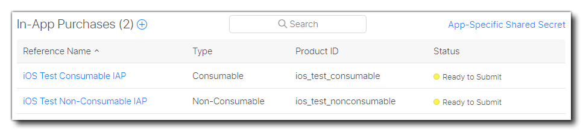

@title Setting Up

# Setup

In this guide we'll be looking at how to set up things in the App Store to allow for **In-App Purchases (IAP)** in your macOS, iOS and tvOS apps for the App Store.

[[Warning: You need to make sure to use the right version of the extension. Information on it can be found in the release info.]]

Before continuing, you should have already set up and tested that the exports are working and have a test project or finished game that you want to add IAPs to. You can find out how to set up GameMaker for the different supported platforms here:

* [Setting Up For macOS](https://help.gamemaker.io/hc/en-us/articles/235186128-Setting-Up-For-macOS)
* [Setting Up For iOS (Including iPadOS)](https://help.gamemaker.io/hc/en-us/articles/115001368747-Setting-Up-For-iOS-Including-iPadOS#_ga=2.83227282.525071896.1710877857-1987929704.1700668779)
* [Setting Up For tvOS](https://help.gamemaker.io/hc/en-us/articles/360025349592-Setting-Up-For-tvOS#_ga=2.83227282.525071896.1710877857-1987929704.1700668779)

## Setting Up The App ID

Before you can add any IAP code and test it, you first have to [set up an app listing](https://developer.apple.com/macos/distribution/) on your [App Store Connect Console](https://appstoreconnect.apple.com/) for the game.

Before that, however, you will need to sign in to your [Apple Developer console](https://developer.apple.com/account) and [Register an App ID](https://developer.apple.com/help/account/manage-identifiers/register-an-app-id/).

> **IMPORTANT** If you've already set up the App ID for the project, then you can skip down to the section [Setting Up App Store Connect](#setting-up-app-store-connect).

### Add a new app

The first thing to do is [Add a new app](https://developer.apple.com/help/app-store-connect/create-an-app-record/add-a-new-app).

[[Warning: Make sure to select the correct **Bundle ID** in the **New App** dialog.]]

When filling in the app information, make sure to select **Explicit Bundle ID** and supply a reverse URL format App ID, for example `"com.yoyogames.iosiaptest"`. Wildcard IDs will *not* be valid for creating and testing IAPs:

The app ID will be created and will, by default, already have in-app purchases enabled. You can now move on to setting up the app listing and IAP details through **App Store Connect**.

## Setting Up App Store Connect

Once you have your App ID created, you need to go to [App Store Connect](https://appstoreconnect.apple.com/) and set up a basic store listing and include the information that is required for the in-app purchases you need.

### Add a new IAP

You then need to go to the **Features** tab, and add your first IAP. You can only add one for now, as Apple requires you to upload a binary which includes IAPs before you can create others, but the process for adding them later is the same as we outline here.

When you add the new IAP it can be any one of the types listed in [In-app purchase types](https://developer.apple.com/help/app-store-connect/reference/in-app-purchase-types/):

* **Consumable** - A product that is used once, after which it becomes depleted and must be purchased again.
* **Non-Consumable** - A product that is purchased once and does not expire or decrease with use.
* **Auto-Renewable Subscription** - A product that allows users to purchase dynamic content for a set period. This type of subscription renews automatically unless cancelled by the user.
* **Non-Renewing Subscription** - A product that allows users to purchase a service with a limited duration. The content of this in-app purchase can be static. This type of subscription does not renew automatically.

In this case we probably want to start with [creating a consumable IAP](https://developer.apple.com/help/app-store-connect/manage-in-app-purchases/create-consumable-or-non-consumable-in-app-purchases/), so select that then fill in the IAP details.

[[Note: The **Product ID** will be used to identify the IAP in GameMaker so be sure to make it appropriate (in this guide we'll call it `ios_test_consumable`).]]

> **IMPORTANT** When targeting both iOS and macOS, Apple requires that you use different, **unique** product identifiers and doesn't distinguish between the two platforms, which is why in the examples on this page we use an "ios" prefix on the product IDs. iOS IAPs are also valid for tvOS so you do not need to set up different ones in that case.

You can then go ahead and fill in the rest of the IAP details (price, descriptions, etc.) - and be sure to supply a 640x920px screenshot in the review information, otherwise you'll get a "missing metadata" error. Once that's all done, click the **Save** button.

Later, after sending that first binary which includes IAP support, you will go through this process again and create an IAP listing for each purchase option that you want to include in your game. For the purposes of this tutorial we have made a second IAP called `ios_test_nonconsumable`, so our panel looks like this:

Once you have all the IAPs set up that you'd like to include you can continue on to setting up test accounts.

## Setting Up A Sandbox Tester Account

Now that you've set up the initial IAP product you need to set up at least one **Sandbox Tester Account**. This account will be used to test the IAPs and any purchases will not be charged when using this account.

> See: [Create Sandbox Apple IDs](https://developer.apple.com/help/app-store-connect/test-in-app-purchases/create-sandbox-apple-ids)

To set up this test account you need to go to **App Store Connect** > **Users and Access** > **Sandbox Testers** and then click the **+** button to add a new user:

Fill in the details required then press **Save**. With that done, you are ready to set up the game in GameMaker and test the IAP process.

[[Note: You cannot use the developer email when setting up test accounts.]]

## Setting Up Your Game

Now that you have your initial IAP setup in the App Store Connect console, you need to prepare your game. For that you'll need to open the project in GameMaker and then go to the [Game Options](https://manual.gamemaker.io/monthly/en/Settings/Game_Options.htm) for the specific OS that you're targeting. Here you should supply the game name and App ID (Bundle ID) that you defined for the project (see the section [Setting Up The App ID](#setting-up-the-app-id)):

Save this setting now by clicking **OK** and you are almost ready to code, build, and then test purchases.

If you're not going to use your own server to validate purchases (something that Apple recommends), there is a way to validate locally - that is almost as secure - using the extension function ${function.iap_ValidateReceipt}. Using this function, however, requires you to supply your **Apple Inc. Root Certificate** and include it with your project in the [Included Files](https://manual.gamemaker.io/monthly/en/Settings/Included_Files.htm).

Download this file and add it to your [Included Files](https://manual.gamemaker.io/monthly/en/Settings/Included_Files.htm) for the project and then you can use the local validation function. For more information on this file, please see the following links:

* https://www.apple.com/certificateauthority/
* https://www.apple.com/appleca/AppleIncRootCertificate.cer
